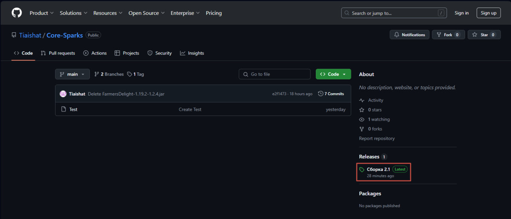
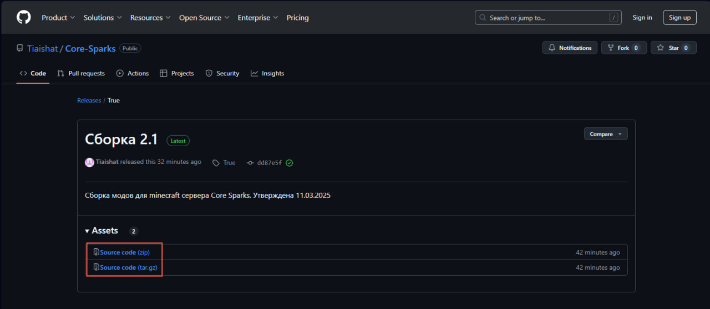
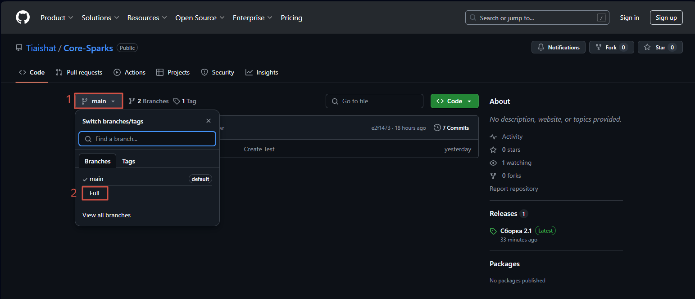
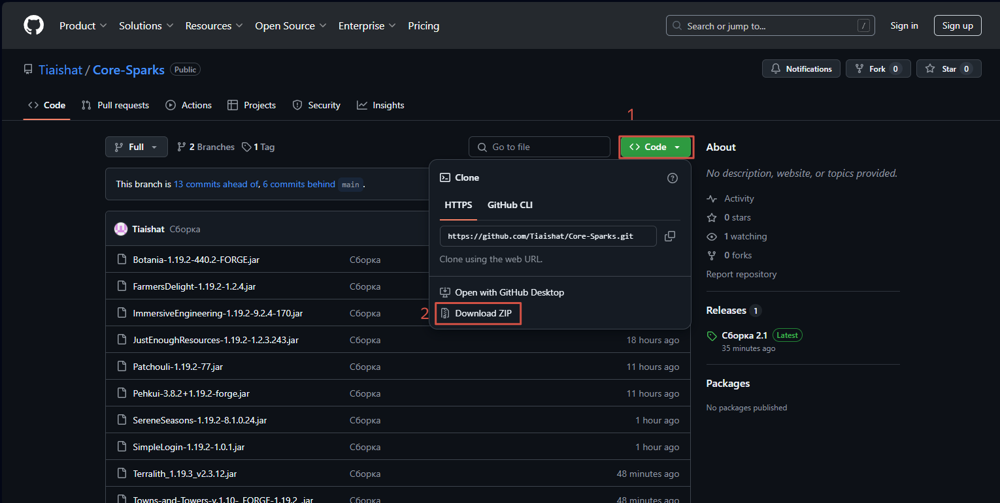
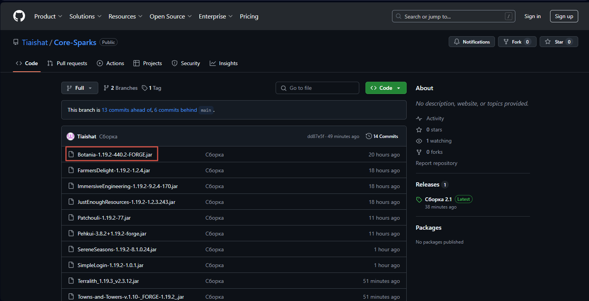
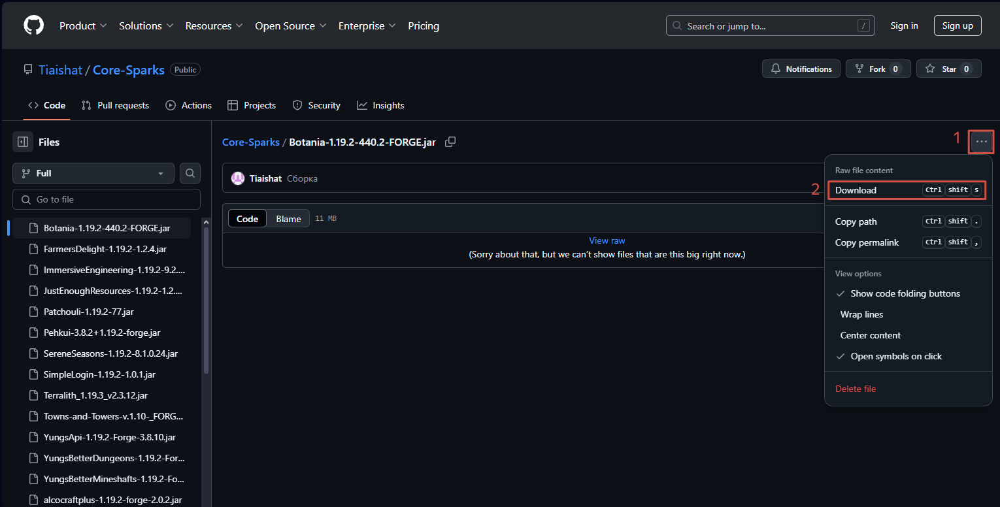

# Туториал на скачивание.
Тут будут представлены 2 вида скачиваний полной сборки и способ скачивания отдельного мода.

## Скачать полную сборку.
### Через релизы.
[На главном экране](https://github.com/Tiaishat/Core-Sparks) с правой части нужно начажать на самую последнюю версию сборки в разделе Releases.

После выбрать вариант загрузки. zip или tar.gz

Дальше всё как и с любой другой зип папкой, распаковываете её в свою папку mods.
### Самостоятельно.
Кратко: кнопка main > ветка full > <>Code > Download ZIP.

Подробный разбор будет начинаться с главного экрана. Там нужно нажать на кнопку __main__ и выбрать из 2 веток ветку __full__.

Перейдя в другую ветку нужно нажать на зелёную кнопку __<>Code__ и скачать zip (__Download ZIP__).

Дальше всё как и с любой другой зип папкой, распаковываете её в свою папку mods.

## Скачать отдельный мод.
Все действия будут в ветке __full__.

Кратко: нужная папка .jar > ... > Download/ ctrl+shift+s

Вспомним как перейти в ветку __full__. На главном ветке(__main__) нужно нажать на кнопку __main__ и выбрать из 2 веток ветку __full__.

Дальше выбрать нужный мод и нажать на его название.

Дальше нажать на 3 точки и __Download__. Не используя кнопку __...__ нужно нажать сочетание клавиш ctrl+shift+s.

Дальше всё как и с любой другой зип папкой, распаковываете её в свою папку mods.
